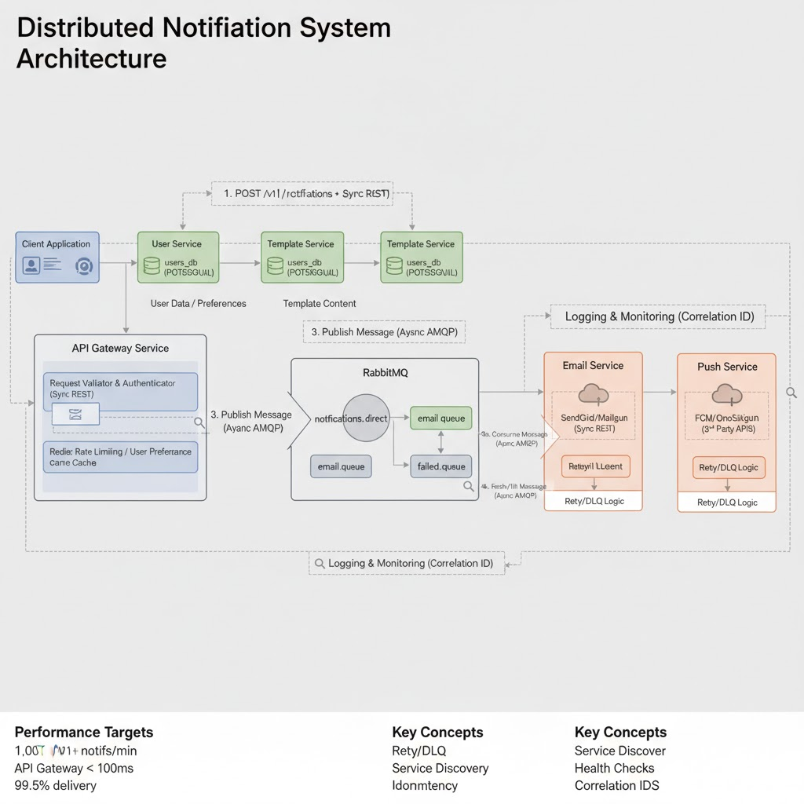

# PROJECT CHARTER: Distributed Notification System

**Project:** Distributed Notification System
**Date:** 9 November 2025
**Source Brief:** [Internal Task Document]
**Distribution:** [Team Member 1], [Team Member 2], [Team Member 3], [Team Member 4]

## 1. 🎯 Project Goal

To build a scalable, fault-tolerant notification system composed of five (5) microservices that sends emails and push notifications. Services will communicate asynchronously via a message queue (RabbitMQ).

This is a **polyglot project**. You can write your service in *any language you choose* (Python, Go, Node.js, PHP, Java). Because of this, our success depends 100% on a non-negotiable set of rules for communication and operation.

**Our guiding principle: Contracts are King.**

---

## 2. 🏛️ Core Technical Principles (The "Law")

If you violate these principles, you will break the system for everyone.

1.  **Contracts First:** The API and message contracts in Section 7 are the *single source of truth*. They must be agreed upon *before* implementation.
2.  **Docker is Mandatory:** Your service *must* run in a Docker container. You are responsible for your service's `Dockerfile`.
3.  **JSON is Our Lingua Franca:** All `REST` API bodies and `RabbitMQ` message payloads *must* be in JSON.
4.  **No Shared Databases:** Each service *must* own its own database (PostgreSQL). You are **forbidden** from directly connecting to another service's database.
5.  **Expose a `/health` Endpoint:** Every service *must* have a `GET /health` endpoint that returns a `200 OK` status for monitoring.
6.  **`snake_case` Naming:** All `JSON` keys (requests, responses, models) *must* use `snake_case`. This is non-negotiable.
7.  **CI/CD is Required:** Each service owner is responsible for ensuring their service can be tested and built in the shared CI/CD workflow.

---

## 3. 🗺️ System Architecture

* **Client:** Sends a `POST` request to the API Gateway.
* **API Gateway:** Validates the request, fetches user data (Sync), publishes a message *of intent* to RabbitMQ (Async), and returns a `202 Accepted` response.
* **User Service:** Manages user data (contact info, preferences). Exposes a `REST` API.
* **Template Service:** Manages notification templates. Exposes a `REST` API.
* **RabbitMQ:** Receives messages and routes them to the correct queue.
* **Email Service:** Consumes from `email.queue`, fetches a template from `Template Service` (Sync), fills variables, and sends the email via a 3rd party (e.g., SendGrid).
* **Push Service:** Consumes from `push.queue`, validates token, and sends a push notification (e.g., FCM).

****


---

## 4. 🧑‍💻 Service Ownership & Team Roles

We are using a **single GitHub repository (monorepo)**. Each service lives in its own top-level directory. **You are the CEO of your service.**

**Service Assignments:**
* **Owner 1 (Team Member 1):** `API Gateway Service`
* **Owner 2 (Team Member 2):** `User Service`
* **Owner 3 (Team Member 3):** `Template Service`
* **Owner 4 (Team Member 4):** `Email Service` + `Push Service`

---

## 5. 🛠️ GitHub & Collaboration Workflow

We will follow a strict, professional Git workflow.

* **`main` Branch:** Locked. Represents production.
* **`develop` Branch:** Integration branch. All PRs merge here.
* **Feature Branches:** `[your-name]/[service-name]/[feature-description]`

**Pull Request (PR) Process:**
1.  Create your feature branch from `develop`.
2.  Do your work (code, `Dockerfile`, tests).
3.  Run the *entire* system locally with `docker-compose up --build` to ensure you broke nothing.
4.  Push your branch and open a PR to `develop`.
5.  Get **at least one (1) approval**.
6.  Merge.

---

## 6. 🔑 Common Configuration & Variables

All variables are defined in the root `.env` file (copied from `.env.example`).

**`/.env.example`**
```ini
# --- SHARED VARIABLES ---
RABBITMQ_HOST=rabbitmq
RABBITMQ_DEFAULT_USER=guest
RABBITMQ_DEFAULT_PASS=guest

REDIS_HOST=redis

# --- SERVICE PORTS ---
GATEWAY_PORT=8000
USER_SERVICE_PORT=8001
TEMPLATE_SERVICE_PORT=8002
EMAIL_SERVICE_PORT=8003
PUSH_SERVICE_PORT=8004

# --- SERVICE-SPECIFIC VARS ---

# User Service
USER_DB_HOST=user-db
USER_DB_NAME=user_db
USER_DB_USER=user
USER_DB_PASS=password

# Template Service
TEMPLATE_DB_HOST=template-db
TEMPLATE_DB_NAME=template_db
TEMPLATE_DB_USER=user
TEMPLATE_DB_PASS=password

# Email Service
MAILGUN_API_KEY=your_key_here

# Push Service
FCM_SERVER_KEY=your_key_here